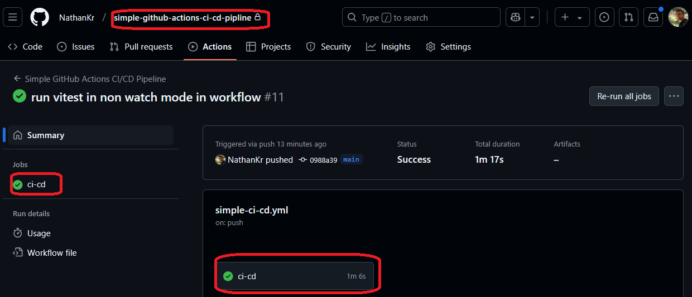
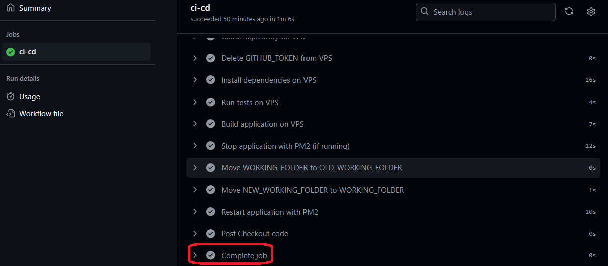

<h1>Project Name</h1>
Simple <strong>CI\CD</strong> workflow with github actions

<h2>Project Description</h2>
Provide simple github actions workflow of <strong>CI\CD</strong> pipeline for private GITHUB repo and run it on digital ocean droplet - VPS

<h2>Motivation</h2>
I already have a workflow that invokes unit tests (<a href='#ref1'>[1]</a>) and a workflow that deploys a private repo on VPS (<a href='#ref3'>[3]</a>). However, these workflows do not handle issues like installing dependencies, compiling, and stopping/starting the process. All of this will be done in this repository using a GitHub Actions workflow.


<h2>Installation</h2>

<h3>GitHub Actions Secrets</h3>
Set VPS_IP and VPS_CICD_PRIVATE_KEY as in <a href='#ref3'>[3]</a>

<h3>VPS</h3>
I concentrate here on the <strong>CI/CD</strong> pipeline and assume the VPS is configured such that it has already run the workflow at least once. Thus: the user cicd exists, node/npm/pm2 are installed, nginx is OK, and so on.


<h2>Usage</h2>

<h3>General</h3>
<p>Push to the main branch in the final stages.</p>

<p>Invoke the following if you want to check the workflow locally at early stages (without SSH):</p>

<pre><code>act</code></pre>

<h3>Tweaks</h3>
<p>It is expected that you take the simple-ci-cd.yml workflow, copy it to your repo, and tweak it to your needs. For example:</p>
<ul>
  <li>Use a different USER on the VPS</li>
  <li>Remove the token steps if the repo is public</li>
  <li>Use cron instead of PM2, so you need to tweak the steps with PM2</li>
  <li>And so on...</li>
</ul>

<h2>Technologies Used</h2>
<ul>
  <li>GitHub Actions: github.run_number, github.event.repository.name</li>
  <li>Linux on VPS - Ubuntu</li>
  <li>Digital Ocean - VPS provider via droplet</li>
  <li>Node.js</li>
  <li>TypeScript</li>
  <li>PM2</li>
  <li>Act</li>
  <li>Vitest</li>
</ul>

<h2>Design</h2>

<h3>Goals</h3>
<ul>
  <li>Automatic, observable, and free workflow to be installed upon push repo (including private) on VPS</li>
  <li>I want the workflow to keep the previous clone so I can do a rollback if required</li>
</ul>

<h3>Questions</h3>
<p>The following are questions that I asked myself when I started. Here are also the answers I came up with during the development of the workflow:</p>

<h4>Bash Commands</h4>
<p><strong>Question:</strong> Use workflow with only bash commands or compose from other scripts/node code?</p>
<p><strong>Answer:</strong> I want to keep it simple, so use only bash commands. However, you can split it into a few scripts with bash commands where each has:</p>
<pre><code>#!/bin/bash
set -e
</code></pre>
<p>so it will stop on the problematic command, and you will see this in the GitHub dashboard.</p>

<h4>Docker</h4>
<p><strong>Question:</strong> Should I use Docker?</p>
<p><strong>Answer:</strong> I assume that the VPS is configured such that at least one workflow has already run correctly. So I don't use Docker—I want to concentrate on <strong>CI/CD</strong> (clone, install, test, run...) and not on system administration.</p>


<h2>Code Structure</h2>
<p>The workflow is <code>simple-ci-cd.yml</code> under <code>.github/workflows</code></p>

<h3>Workflow Variables</h3>


```yml

    env:
      USER: cicd
      VPS_IP: ${{ secrets.VPS_IP }}
      GITHUB_TOKEN_FILE: ~/github_token
      APP_NAME: ${{ github.event.repository.name }}  # Define the application name as the repository name
      WORKING_FOLDER: $HOME/${{ github.event.repository.name }}  # Define the working directory as ~/repo-name      
      OLD_WORKING_FOLDER: $HOME/${{ github.event.repository.name }}_old_${{ github.run_number }} # Define the old working directory with run number
      NEW_WORKING_FOLDER: $HOME/${{ github.event.repository.name }}_new_${{ github.run_number }} # Define the new working directory with run number

```

<h3>Workflow steps</h3>

```yml
      - name: Checkout code
        uses: actions/checkout@v4  # Checkout the code so runner can access the repo files
        with:
          token: ${{ secrets.GITHUB_TOKEN }}

      - name: Configure SSH (on GitHub Actions runner)
        run: |
            mkdir -p ~/.ssh
            echo "${{ secrets.VPS_CICD_PRIVATE_KEY }}" > ~/.ssh/id_rsa
            chmod 600 ~/.ssh/id_rsa
            echo "StrictHostKeyChecking no" > ~/.ssh/config
  
                    
      - name: Transfer GITHUB_TOKEN to VPS
        run: |
            ssh $USER@$VPS_IP "echo '${{ secrets.GITHUB_TOKEN }}' > $GITHUB_TOKEN_FILE"
    
      - name: Clean up NEW_WORKING_FOLDER if it already exists # can happen for re-run from github dashboard
        run: ssh $USER@$VPS_IP "rm -rf $NEW_WORKING_FOLDER"


      - name: Clone Repository on VPS
        run: |
          ssh $USER@$VPS_IP "
            export GITHUB_TOKEN=$(cat $GITHUB_TOKEN_FILE)
            git clone https://${{ github.repository_owner }}:${{ secrets.GITHUB_TOKEN }}@github.com/${{ github.repository }} $NEW_WORKING_FOLDER
          "

      - name: Delete GITHUB_TOKEN from VPS
        run: |
            ssh $USER@$VPS_IP "rm $GITHUB_TOKEN_FILE"

      - name: Install dependencies on VPS
        run: ssh $USER@$VPS_IP "cd $NEW_WORKING_FOLDER && npm install"  # Install dependencies using npm on the VPS
    

      - name: Run tests on VPS
        run: ssh $USER@$VPS_IP "cd $NEW_WORKING_FOLDER && npm run test -- --run"  # Run tests in non-watch mode on the VPS
    

      - name: Build application on VPS
        run: ssh $USER@$VPS_IP "cd $NEW_WORKING_FOLDER && NODE_ENV=production npm run build"  # Build the application using npm on the VPS

      - name: Stop application with PM2 (if running)
        run: |
          ssh $USER@$VPS_IP "
            if pm2 list | grep -q '${{ env.APP_NAME }}'; then
              pm2 stop '${{ env.APP_NAME }}';
            fi
          "

      - name: Move WORKING_FOLDER to OLD_WORKING_FOLDER
        run: ssh $USER@$VPS_IP "
          if [ -d '$WORKING_FOLDER' ]; then
            mv '$WORKING_FOLDER' '$OLD_WORKING_FOLDER';
          fi"
        
      - name: Move NEW_WORKING_FOLDER to WORKING_FOLDER
        run: ssh $USER@$VPS_IP "mv $NEW_WORKING_FOLDER $WORKING_FOLDER"  # Move the new working folder to the working folder on the VPS

      - name: Restart application with PM2
        run: | 
          ssh $USER@$VPS_IP "
            if pm2 list | grep -q '${{ env.APP_NAME }}'; then
              pm2 restart '${{ env.APP_NAME }}';
            else
              pm2 start npm --name '${{ env.APP_NAME }}' -- run start;
            fi
            pm2 save
          "

```

<h2>Demo</h2>
<p>The following is an image of a successful workflow run:</p>


<p>The following is an image of the workflow details - the last steps are shown:</p>



<h2>Points of Interest</h2>
<ul>
  <li>It is useful to use <code>act</code> (<a href='#ref2'>[2]</a>) at least when SSH and keys are not involved. Check, for example, tag 0.2.</li>
  <li>I was looking for a unique identifier to store old repo versions on the VPS. I was thinking about a timestamp, and this was used in a few steps. I tried to use <code>env</code>, but it gave a warning. So instead, I have used GitHub Actions out-of-the-box constant.</li>
  <li><code>github.run_number</code>: This increments by one on every run and serves as an ID also on the GitHub repo dashboard under actions.</li>
</ul>


<h2>Future Work</h2>
<ul>
  <li>Try to create a more generic workflow, possibly putting operations in bash scripts.</li>
  <li>Use for more real-world repositories, e.g., Next.js with environment variables.</li>
  <li>Currently, the GitHub token is copied to the VPS (and later deleted), but although the VPS should be secured, it's not optimal for security reasons. You might clone the repo on the runner and then copy it to the VPS.</li>
</ul>


<h2>References</h2>
<ol>
  <li id='ref1'><a href='https://youtu.be/x239z6DdE0A'>Introduction to GitHub Actions: Learn Workflows with Examples</a></li>
  <li id='ref2'><a href='https://youtu.be/Mir-uLSQmwA'>Efficiently Run GitHub Actions Workflows Locally with act Tool</a></li>
  <li id='ref3'><a href='https://youtu.be/Aj8vqPHzDos'>Deploy Private Repos to VPS with GitHub Actions: Simplified Workflow</a></li>
</ol>

